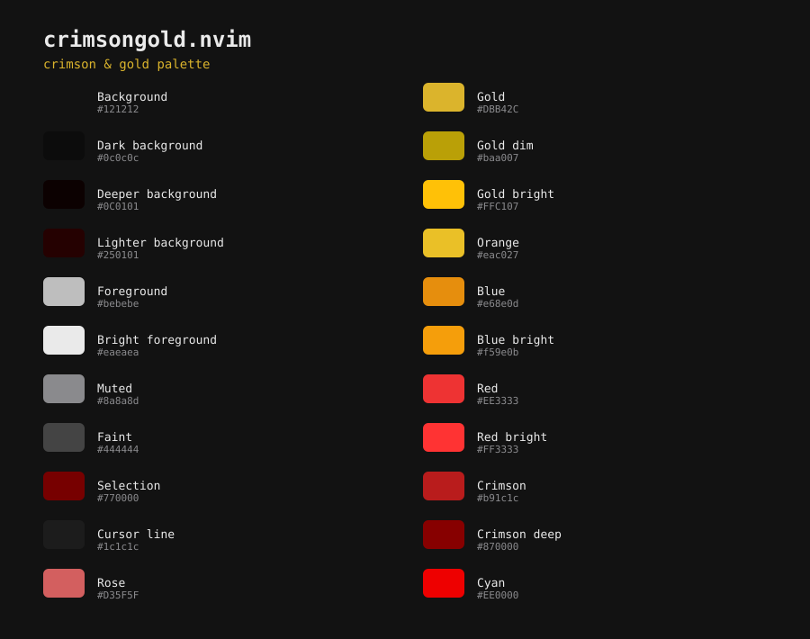
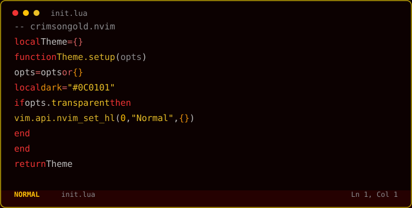
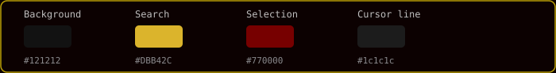

# crimsongold.nvim

A dark **crimson & gold** colorscheme for Neovim, built from the
[Omarchy](https://github.com/basecamp/omarchy) `crimson-gold` theme
(Spicetify *Starry Night – Sunrise* inspired): deep crimson-black backgrounds,
a gold accent family, and rose tones.

## Palette



## Showcase





## Install

```lua
-- lazy.nvim
{ "knappkevin/crimsongold.nvim", priority = 1000, config = true }
```

```lua
vim.cmd.colorscheme("crimsongold")
```

## Options

```lua
require("crimsongold").setup({
  transparent = false, -- transparent editor background
  italic = true,       -- italic comments / emphasis
  overrides = {},      -- per-group highlight overrides
})
```

`overrides` accepts the same shape as highlight specs:

```lua
overrides = {
  Comment = { fg = "#8a8a8d", style = "italic" },
  Normal = { bg = "#0c0c0c" },
  String = function(hl, palette) return vim.tbl_deep_extend("force", hl, { fg = palette.gold }) end,
}
```

Access the palette programmatically with `require("crimsongold").colors()`.
